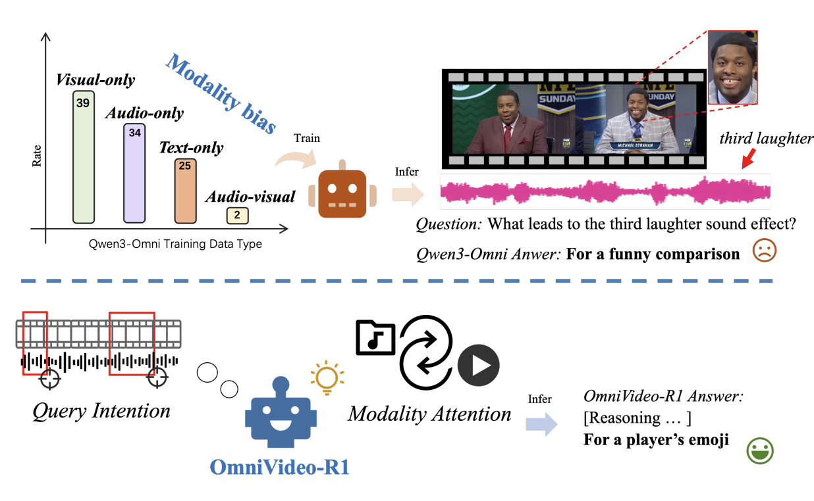

# OmniVideo-R1: Reinforcing Audio-visual Reasoning with Query Intention and Modality Attention
[](https://arxiv.org/abs/2602.05847)

## Instruction
While humans perceive the world through diverse modalities that operate synergistically to support a holistic understanding of their surroundings, existing omnivideo models still face substantial challenges on audio-visual understanding tasks. In this paper, we propose OmniVideo-R1, a novel reinforced framework that improves mixed-modality reasoning. OmniVideo-R1 empowers models to "think with omnimodal cues" by two key strategies: (1) query-intensive grounding based on self-supervised learning paradigms; and (2) modality-attentive fusion built upon contrastive learning paradigms. Extensive experiments on multiple benchmarks demonstrate that OmniVideo-R1 consistently outperforms strong baselines, highlighting its effectiveness and robust generalization capabilities.

## Method overview


## Quick Start

### 1. Installation

```bash
# Install base dependencies
pip install -r requirements.txt

# Install customized ms-swift
cd train
pip install -e .
```

### 2. Data Preprocessing

The pre-processed training data is readily available under the `data/` directory. The raw video files should be downloaded from [LLaVA-Video-178K](https://huggingface.co/datasets/lmms-lab/LLaVA-Video-178K) and [VideoVista_Train](https://huggingface.co/datasets/Uni-MoE/VideoVista_Train), and the corresponding audio tracks should be extracted from them.

If you want to reprocess yourself, you can use the scripts in `preprocess` folder.

### 3. Training

```bash
cd scripts
## QI stage
bash train_multinode_qi.sh
## MA stage
bash train_multinode_ma.sh
```

### 4. Evaluation

```bash
# Step 1: Start vLLM inference server
bash eval/infer_vllm.sh

# Step 2: Run OmniVideoBench evaluation
bash eval/run_eval.sh
```

## Model Output Format

The model is trained to produce structured outputs in the following format:

```
<time>1.0-2.5</time><caption>A person holds a paintbrush and dips it into red paint, with soft brush-stroking sound.</caption>
<time>5.2-6.8</time><caption>The person paints a sun on a white canvas.</caption>
<thinking>Let me think. The first segment shows the person preparing to paint, and the second shows them actually painting a sun. So the main action should be painting.</thinking>
<answer>Painting a sun on a canvas</answer>
```

## Data Format

Training data uses JSONL format (one sample per line) with the following core fields:

```json
{
  "messages": [
    {"role": "system", "content": "..."},
    {"role": "user", "content": "<video><audio>Question text..."}
  ],
  "videos": ["/path/to/video.mp4"],
  "audios": ["/path/to/audio.mp3"],
  "solution": "A. Correct answer",
  "data_source": "llava"
}
```

## Tech Stack
- **Training Framework**: [ms-swift](https://github.com/modelscope/swift) ([Megatron](https://github.com/NVIDIA/Megatron-LM) backend)
- **Base Model**: Qwen3-Omni-30B-A3B-Instruct
- **Inference Engine**: vLLM
- **Parallelism Strategy**: Tensor Parallel + Expert Model Parallel + Pipeline Parallel + Sequence Parallel
- **Fine-tuning Method**: LoRA (freezing ViT, Aligner, and TTS modules)

## Dependencies

Key dependencies include:

- PyTorch ≥ 2.0
- Transformers ≥ 4.40
- DeepSpeed ≥ 0.12
- vLLM ≥ 0.4
- PEFT ≥ 0.8
- TRL ≥ 0.7

See `requirements.txt` for the full list.

## Bibtex
If you find 3DThinker helpful for your work, please cite
```
@article{chen2026omnivideo,
  title={OmniVideo-R1: Reinforcing Audio-visual Reasoning with Query Intention and Modality Attention},
  author={Chen, Zhangquan and Tao, Jiale and Li, Ruihuang and Hu, Yihao and Chen, Ruitao and Yang, Zhantao and Yu, Xinlei and Jing, Haodong and Zhang, Manyuan and Shao, Shuai and others},
  journal={arXiv preprint arXiv:2602.05847},
  year={2026}
}
```
